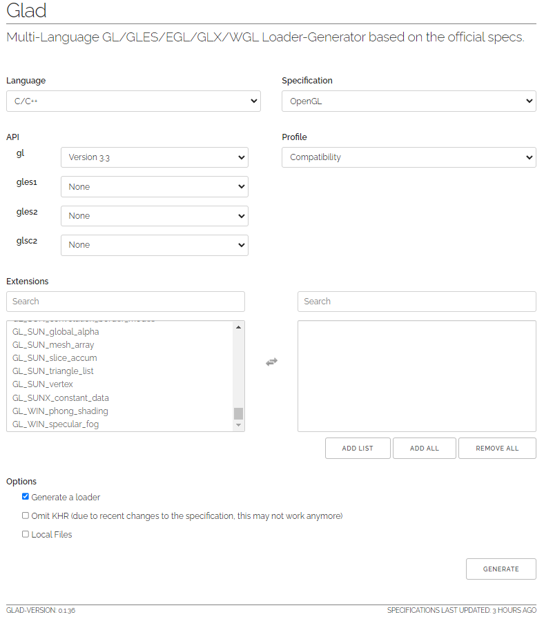

# GLFW CMake Starter

This project provides a simple starter template using **CMake** to set up a cross-platform application with **GLFW**. The project runs on Windows, Linux, and macOS, and includes an external setup for **GLAD** to handle OpenGL function loading and also GLM for math.

This repository is a fork of [Juliette Foucaut's GLFW-CMake-Starter](https://github.com/juliettef/GLFW-CMake-starter) and uses **GLAD** from [glad.dav1d.de](https://glad.dav1d.de/) to meet OpenGL version 3.3 specifications required for projects from [LearnOpenGL.com](https://learnopengl.com).

## Requirements
- **OpenGL version**: 3.3 (as per LearnOpenGL tutorial requirements). Configure this when generating GLAD as shown below.
  
  Example screenshot of GLAD configuration:
  

- GLM version 0.9.8.5 download at [glm.g-truc.net](https://glm.g-truc.net/0.9.8)

## Resources
- **GLFW official site**: [glfw.org](https://www.glfw.org/)  
- **GLFW GitHub repo**: [github.com/glfw/glfw](https://github.com/glfw/glfw)

## Project Structure

Make sure to place the downloaded **GLAD** files inside the `external/glad` folder as shown below. The `external` directory contains third-party dependencies like GLAD and GLFW.
For the math part also place the downloaded glm to `external/glm`.

```
├───external
│   ├───glad
│   │   ├───include
│   │   │   ├───glad
│   │   │   └───KHR
│   │   └───src
│   └───glfw
│       ├───.github
│       │   └───workflows
│       ├───CMake
│       │   └───modules
│       ├───deps
│       │   ├───glad
│       │   ├───mingw
│       │   └───wayland
│       ├───docs
│       ├───examples
│       ├───include
│       │   └───GLFW
│       ├───src
│       └───tests
└───src
    ├───main.cpp  <-- Entry file
```

## Getting Started

To clone this repository with all submodules (like GLAD), run the following command:

```bash
git clone --recursive https://github.com/billymosis/GLFW-CMake-starter-learnopengl.com
```

Next, navigate into the project directory:

```bash
cd GLFW-CMake-starter
```

## Building the Project with CMake

Follow these steps to build the project using CMake:

1. **Create a build directory**:
   ```bash
   mkdir build
   cd build
   ```

2. **Generate build files with CMake**:
   - For **Unix-based systems** (Linux/macOS):
     ```bash
     cmake ..
     ```
   - For **MinGW** (on Windows), use the `-G` option:
     ```bash
     cmake .. -G "MinGW Makefiles"
     ```

3. **Build the project**:
   - For **Linux/macOS** or **MinGW**:
     ```bash
     make all
     ```
   - For **Visual Studio** on Windows, open the generated `.sln` file:
     ```bash
     GLFW-CMake-starter.sln
     ```

## Additional Information

- This project uses **GLAD** for OpenGL function management. Ensure you've selected OpenGL 3.3 when configuring GLAD to match LearnOpenGL tutorials.
- The project is designed to be easily extendable for your own projects or tutorials.

Feel free to modify the project or contribute enhancements. Remember to follow the licensing terms in the `LICENSE` file.
